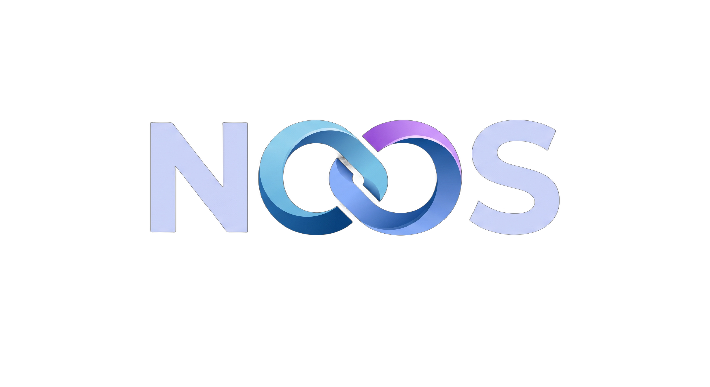

<div align="center">
  
  <br/><br/>

  # 🛍️ Noos NAS App Store
  ### *La Boutique Applicative Officielle & Souveraine pour Noos NAS Edition*

  [](https://github.com/Chomiam/noos_nas_store)
  [](https://docs.docker.com/compose/)
  [](#)
  [](#)
  [](#)
  [](LICENSE)

  <p align="center">
    <strong>Déployez les meilleurs services open-source du monde en un seul clic. Vos applications, vos données, votre cloud personnel sans intermédiaire.</strong>
  </p>
</div>

---

## 🌟 Transformez Votre Serveur en Hub Numérique Tout-en-Un

La gestion manuelle de conteneurs Docker (fichiers YAML complexes, conflits de ports, volumes éparpillés, droits d'accès corrompus) est l'une des causes principales de frustration dans l'auto-hébergement.

Le **Noos NAS App Store** résout définitivement ce problème en fournissant un catalogue certifié de plus de **640 applications prêtes à l'emploi**, optimisées spécifiquement pour l'écosystème Noos NAS :

- 🚀 **Déploiement en 1-Clic** : Sélectionnez une application, ajustez ses réglages en toute simplicité et lancez-la instantanément.
- 💾 **Données 100% Unifiées** : Fini les fichiers dispersés aux quatre coins du système de fichiers. Les données de chaque conteneur sont centralisées dans `/home/<utilisateur>/docker/<app_id>/`. La sauvegarde ou la migration de vos données devient aussi simple que de copier un dossier.
- 🎬 **Accélération Matérielle GPU Automatique** : Le store détecte les applications multimédia et d'intelligence artificielle (Immich, Jellyfin, Plex, Ollama) et injecte dynamiquement l'accélération matérielle (`/dev/dri`) pour un transcodage 4K fluide.
- 🛡️ **Isolation & Sécurité Stricte** : Chaque conteneur tourne avec les permissions utilisateur adéquates (`0775`) et les ports réseau requis sont enregistrés proprement dans le pare-feu du NAS.
- 🌍 **Sélecteur Intelligent de Fuseaux Horaires** : Finies les erreurs de frappe, le fuseau horaire (`TZ`) se choisit via un menu déroulant complet respectant le standard IANA (ex: `Europe/Paris`).

---

## 📦 Les Incontournables du Catalogue (Extraits par Catégorie)

### 📸 Photos, Vidéos & Streaming Multimédia
| Application | Port | Description | Atout Noos NAS |
| :--- | :--- | :--- | :--- |
| **Immich** | `2283` | L'alternative souveraine à Google Photos & Apple Photos avec reconnaissance faciale IA. | Support GPU & Machine Learning intégré |
| **Jellyfin** | `8096` | Le serveur de streaming multimédia libre sans abonnement (films, séries, musique). | Transcodage matériel 4K HDR natif |
| **Plex** | `32400` | La référence du streaming personnel pour tous vos écrans et téléviseurs connectés. | Détection de transcodeur matériel |
| **Audiobookshelf** | `13378` | Serveur dédié aux livres audio et podcasts avec synchronisation de progression. | Métadonnées automatiques |
| **Calibre-Web** | `8083` | Votre bibliothèque numérique d'eBooks accessible sur liseuse et tablette. | Compatible liseuses Kobo & Kindle |

---

### 🛡️ Sécurité, Confidentialité & Réseau
| Application | Port | Description | Atout Noos NAS |
| :--- | :--- | :--- | :--- |
| **Vaultwarden** | `8222` | Coffre-fort de mots de passe souverain compatible avec toutes les applications Bitwarden. | Ultra-léger en mémoire vive (< 15 Mo) |
| **AdGuard Home** | `3000` | Bloqueur de publicités et de traceurs pour l'ensemble des appareils de votre réseau local. | Protection DNS au niveau du réseau |
| **Uptime Kuma** | `3001` | Surveillance en direct de la disponibilité de vos services, sites et conteneurs. | Alertes Telegram, Discord, Email |
| **Nginx Proxy Manager** | `81` | Gestionnaire d'accès inverse avec génération automatique de certificats SSL Let's Encrypt. | Interface visuelle accessible à tous |

---

### ☁️ Collaboration, Documents & Cloud Privé
| Application | Port | Description | Atout Noos NAS |
| :--- | :--- | :--- | :--- |
| **Nextcloud Hub** | `8080` | Suite collaborative complète : fichiers, agenda, contacts, messagerie et visioconférence. | Stockage sur vos disques redondés |
| **FileBrowser** | `8082` | Gestionnaire de fichiers web rapide avec prévisualisation et liens de partage temporaires. | Accès rapide sans complexité |
| **Paperless-ngx** | `8000` | Numérisation, indexation OCR et archivage intelligent de tous vos documents administratifs. | Reconnaissance automatique de texte |
| **Actual Budget** | `5006` | Gestionnaire de finances personnelles et de budget familial 100% local et chiffré. | Zéro accès tiers à vos comptes |

---

### 🏡 Domotique & Maison Connectée (IoT)
| Application | Port | Description | Atout Noos NAS |
| :--- | :--- | :--- | :--- |
| **Home Assistant** | `8123` | Le cœur battant de votre maison connectée réunissant tous vos protocoles et objets. | Haute disponibilité 24/7 |
| **Zigbee2MQTT** | `8080` | Pont Zigbee universel pour contrôler vos ampoules, prises et capteurs sans pont propriétaire. | Compatible coordinateurs USB |
| **Mosquitto** | `1883` | Broker MQTT léger pour la communication temps réel entre vos microcontrôleurs et capteurs. | Faible consommation processeur |

---

### 📥 Téléchargements & Automatisation
| Application | Port | Description | Atout Noos NAS |
| :--- | :--- | :--- | :--- |
| **qBittorrent** | `8085` | Client BitTorrent haute performance avec interface web sécurisée. | Gestion des vitesses et planifications |
| **Transmission** | `9091` | Client BitTorrent minimaliste, ultra-rapide et économe en ressources. | Idéal pour petits processeurs |
| **Jellyseerr** | `5055` | Portail de requêtes de médias pour gérer les demandes de films/séries de votre foyer. | Intégration Jellyfin & Plex |

---

## 🛠️ Standard d'Ingénierie & Architecture Déclarative

Chaque application du magasin respecte rigoureusement une structure normalisée garantissant une exécution sans faille :

```text
apps/<app_id>/
├── compose.yaml          # Fichier Docker Compose officiel annoté et standardisé
└── manifest.json         # Métadonnées (Nom, catégorie, icône HD, port, description)
```

### Format du fichier `manifest.json` :
```json
{
  "id": "immich",
  "name": "Immich",
  "category": "Multimédia",
  "port": 2283,
  "description": "Plateforme d'hébergement et de sauvegarde de photos et vidéos personnelles.",
  "icon": "https://raw.githubusercontent.com/Chomiam/noos_nas_store/main/apps/immich/icon.png",
  "recommended": true
}
```

---

## 🤝 Comment Contribuer ou Proposer une Application ?

Vous souhaitez ajouter une nouvelle application au Store officiel Noos NAS ? Les contributions sont chaleureusement bienvenues !

1. Forkez le dépôt `noos_nas_store`.
2. Créez un dossier `apps/<nom_application>/` contenant votre `compose.yaml` et votre `manifest.json`.
3. Assurez-vous que les volumes montent des chemins relatifs ou sous `/home/${USER}/docker/<nom_application>/`.
4. Ouvrez une Pull Request sur la branche `main`. Notre pipeline d'intégration continue vérifiera automatiquement la conformité du manifest et l'intégrité de la configuration.

---

## 📄 Licence

Ce projet est distribué sous licence libre et copyleft **GNU General Public License v3.0 (GPLv3)**.  
Consultez le fichier [LICENSE](LICENSE) pour plus d'informations.

---

<div align="center">
  <sub>Fait partie de l'écosystème officiel <a href="https://github.com/Chomiam/noos-nas">Noos NAS Edition</a>.</sub>
</div>
